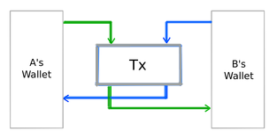
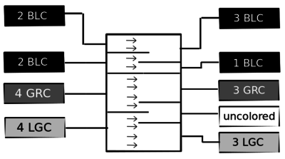
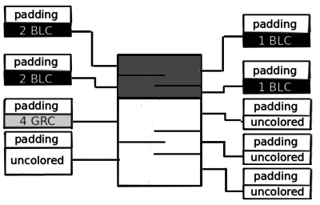

Colored Coins - Tokens Built Atop the Bitcoin Blockchain

by Yoni Assia, Vitalik Buterin, Lior Hakim, Meni Rosenfeld, and Rotem Lev
2013


This document describes the original concept of Colored Coins.
To view the updated specs please visit the [official Colored Coins Github org](https://github.com/Colored-Coins/Colored-Coins-Protocol-Specification)


## Abstract


Bitcoin is the world's first decentralized digital currency, allowing the easy storage and transfer of cryptographic tokens, using a peer-to-peer network to carry information, hashing as a synchronization signal to prevent double-spending, and a powerful scripting system to determine ownership of the tokens. There is a growing technology and business infrastructure supporting it.

By the original design bitcoins are fungible, acting as a neutral medium of exchange. However, by carefully tracking the origin of a given bitcoin, it is possible to "color" a set of bitcoins to distinguish it from the rest. These bitcoins can then have special properties supported by either an issuing agent or by public agreement, and have value independent of the face value of the underlying bitcoins. Such colored bitcoins can be used for alternative currencies, commodity certificates, smart property, and other financial instruments such as stocks and bonds.

Because colored coins make use of the existing Bitcoin infrastructure and can be stored and transferred without the need for a third party, and even be exchanged for one another in an atomic transaction, they can open the way for the decentralized exchange of things that are not possible by traditional methods. In this paper we will discuss the implementation details of colored coins and some of their use cases.


## Background


The advent of Satoshi Nakamoto's Bitcoin in 2009 has fundamentally enlarged the scope of what can be done with cryptography. Before Bitcoin, any attempt to manage any kind of digital assets online without a centralized authority always ran into a fundamental problem that was thought to be intractable: the double-spending threat. If a digital asset is nothing but a file consisting of ones and zeroes, the theory went, what stops anyone from simply making a hundred copies of that file and thereby multiplying their own wealth? With a central authority, the problem is easy; the central authority can simply keep track of who owns what quantity of the digital asset. However, centralization is problematic for many reasons: a centralized authority creates a single point of failure which can be hacked, shut down due to regulatory pressure, or even leverage its privileged status to benefit itself at the wider community's expense. Although some abortive attempts were made by Wei Dai and Nick Szabo in 1998 and 2005 as well as Adam Back's hashcash, Bitcoin marks the first time that anyone has created a fully functional, viable decentralized solution - a solution which is rapidly gaining popularity and mainstream acceptance all around the world.

Because of its fully digital and decentralized design, Bitcoin offers a number of advantages over existing payment systems. Its transactional irreversibility provides for a high degree of security, allowing merchants to considerably cut costs in high-risk industries. Its lack of a centralized authority has rendered it invulnerable to so-called "financial censorship" attempts such as the financial blockade of Wikileaks by banks and credit card companies in 2011; while donations through the traditional financial system dropped by 95% as a result of the blockade, Bitcoin donations kept coming in at full steam the whole way through [1]. Its technical ease of use is allowing entrepreneurs around the world to start up prediction markets, notarization services, gambling sites, paywalls and many other types of businesses with zero startup cost in only a few weeks' worth of development work. Finally, most interestingly of all, the public nature of Bitcoin transactions potentially allows for a degree of radical transparency for businesses and nonprofit organizations that is simply not possible any other way; although this area has not yet been fully developed in practice, one early example of such a system being implemented in practice is the "provably fair gambling" systems used by sites like SatoshiDice, allowing users to cryptographically verify that the site is not cheating on bets. Given all of these advantages, the natural question is: is it possible to use the same functionality for other applications as well?


The answer, it turns out, is yes. The fundamental innovation behind Bitcoin, that of using cryptographic proof of work to maintain a secure distributed database, is good for more than just the single limited-supply currency originally envisioned by Satoshi Nakamoto in 2009; exactly the same technology can be used to maintain ownership of company shares, "smart property", alternative currencies, bank deposits and much more. Anything which is (1) representable as a digital asset, and (2) a "rivalrous good", meaning that only one person can own it at a time, is potentially fair game for representation in the Bitcoin blockchain. However, Bitcoin does not include any facilities for doing this by default; to do any of these things, an additional protocol is required. And BitcoinX intends to accomplish just that.


## Overview

The idea is to open up Bitcoin as we know it now into two separate layers, being, the underlying transactional network based on its cryptographic technology, and an overlay network of issuance of distinct instruments encapsulated in a design we call 'colored coins.'


If we can issue many distinct instruments within the Bitcoin ecosystem, there are many potential use cases:


- A company might want to **issue shares** using colored coins, taking advantage of the Bitcoin infrastructure to allow people to maintain ownership of shares and trade shares, and even allow voting and pay dividends over the Bitcoin blockchain.

- **Smart property**: suppose there is a car rental company. The company can release one colored coin to represent each car, and then configure the car to turn on only if it receives a message signed with the private key that currently owns the colored coin. It can then release a smartphone app that anyone can use to broadcast a message signed with their private key, and put up the colored coins on a trading platform. Anyone will be able to then purchase a colored coin, use the car for whatever period of time using the smartphone app as a "car key", and sell the coin again at their leisure.

- A local community might wish to create a **community currency**, using the Bitcoin infrastructure to securely store funds.

- A company may wish to create a **corporate currency**, such as Air Miles rewards points, or even plain **coupons**.

- An issuer might wish to release a coin to **represent deposits**, allowing people to trade, for example, "Bitstamp-USD coins" or some gold storage company’s "gold coins".

- Decentrally managing ownership of **digital collectibles** such as original artworks - just like art collectors buy and sell original copies of famous paintings for millions of dollars today, colored coins allow us to do the same with purely digital objects, such as songs, movies, e-books and software, as well, by storing the current ownership of the work as a colored coin on the blockchain.

- Using colored coins to trade and manage **access and subscription services**. For example, a museum, a subway or an online service like Netflix may issue passes as colored coins and release a smartphone app that can be used to make a signature proving ownership of a pass in person, allowing these passes to be simultaneously transferable, fully digital and securely uncopyable.


## Technical background: Bitcoin transactions

The fundamental object in the Bitcoin network is called a Bitcoin transaction. A Bitcoin transaction contains:

1. A set of **inputs**, each of which contains (i) the **transaction hash** and **output index** of one of the outputs of a previous transaction, and (ii) a **digital signature** which serves as cryptographic proof that the recipient of the previous transaction output authorizes this transaction.
2. A set of **outputs**, each of which contains (i) the **value** (amount of BTC) going to the output, and (ii) a **script**, which determines the conditions under which the output can be spent.


(an example of transactions illustrating inputs and outputs)


The precise nature of scripts and signatures is not important for the purposes of the colored coins protocol; a useful simplification is to think of the output script as a public key and the signature as a standard cryptographic digital signature made with the corresponding private key. Every output script maps to a unique Bitcoin address, and it is possible to efficiently convert back and forth between the two representations.


The algorithm for validating a transaction is as follows:


```
INPUT_SUM = 0
for input in inputs:
   prevtx = get_tx_from_blockchain(input.prev_out.hash)
   if prevtx == NULL:
       return FALSE
   if is_output_already_spent(prevtx,input.prev_out.index):
       return FALSE
   if not verify(input.sig, prevtx.outputs[input.prev_out.index].script):
       return FALSE
   INPUT_SUM += prevtx.outputs[input.prev_out.index].value
OUTPUT_SUM = 0
for output in outputs:
   OUTPUT_SUM += output.value
if INPUT_SUM < OUTPUT_SUM:
   return FALSE
return TRUE
```


Note that Bitcoin does not recognize the concept of "address balances"; that is simply a layer of convenience added on top by Bitcoin software. If your Bitcoin wallet tells you that you have 50 BTC, what that means is that there are 50 BTC worth of transaction outputs (perhaps one output of 50 BTC, perhaps four of 12.5 BTC; any combination works) whose output scripts correspond to your address.


But what if there is no set of transaction outputs that you can combine into a transaction to send exactly what you want? In that case, Bitcoin uses a concept called change. Essentially, you put more than you need to into the transaction, but you send the excess back to yourself in one of the outputs.


Usually, change goes into a new address to preserve privacy. Using these transactions, it's possible to maintain user account balances and send to other users any amount desired.


(example of sending transaction with change)


## Genesis transactions


In order to issue a new color, one must release the coins of that color by creating a genesis transaction. A colored coin genesis transaction has specific rules that its inputs and outputs must follow.


### Inputs

For the inputs of a genesis transaction, there are two cases to consider:

- **Non-reissuable colors** - in the non-reissuable case, the inputs are irrelevant; the issuer will not have any power once the transaction is issued, so all that matters is the transaction itself (specifically, its outputs).

- **Reissuable colors** -  here, the issuer should choose one secure address as an "issuing address", and set input 0 of the transaction to come from that address. Later on, the issuer will be able to issue more units of the color by creating another genesis transaction with the same address at input 0. Inputs 1+ of a genesis transaction are always irrelevant from the perspective of the colored coins protocol; the only purpose of adding additional inputs is if you do not have a single input capable of paying for the colored coin genesis all by itself. Also, note that one issuing address can be responsible for at most one reissuable color, and if an issuing address is responsible for any reissuable colors it cannot be responsible for any non-reissuable colors.

### Outputs

The outputs of a colored coin genesis consist of a set of outputs sending the colored coins to their original owners, followed by one OP_RETURN data output, followed by one or more “change” outputs to send excess uncolored bitcoins back to the issuer. An OP_RETURN output is allowed to have 40 bytes to remain as a standard transaction, and all of the data identifying the transaction as a colored coin transaction will be inside this data field. The data field will be organized as follows:

```
        [0...4]: [0,67,67,80,0] (that's "CCP" padded with a zero-byte on both sides)
        [5...6]: protocol version number (currently 1)
        [7...8]: reissuance policy (0 for non-reissuable, 65535 for infinitely reissuable from the genesis address)
        [9..39]: optional (data about the color)
```

The scheme is intended to be hierarchical; in the future, "COLOR" will always remain in bytes 0...4, and a version number will always be in bytes 5...6, but a future version may have a different intention for bytes 7-39 than to describe a re-issuance policy and optional data. Even in the scope of version 0, a future reissuance policy may specify some data in bytes [9...39]. Currently, the data in bytes 9...39 can be in any format; one possibility is for the issuer to include the color's name and URL.


Note that, in the case of re-issuable colors, a genesis address should be kept highly secure, since if an attacker manages to gain access to the genesis they will have unlimited power to issue new colored coins of that color. Thus, it is very strongly recommended that the address should be at least a 2-of-3 multisignature address, or perhaps even 3-of-5, with private keys held in cold storage. In the case of non-reissuable colors, the issuer needs no security unless they themselves intend to hold on to some portion of the colored coins, in which case the same security considerations apply to them as for any other digital assets.


Full clients that download the entire blockchain should attempt to process every genesis, and store information about as many colors as possible. Light clients, including web-based clients, should require users to import colors by submitting the transaction hash of the color genesis, at which point they query a server for the genesis transaction to extract the information about the color.


### Example

```
        inputs: [
                17ztLiaGdWcWFX8CgYqWGQPEizepPLsSrb : 500000,
                19GAFukX9ixSDLy1p2UEed2mpDQ69QPUXr : 2125735,
                1MyK5te6U6zGoom68nVEzTU2x949ReNySN : 2500000
        ]
        outputs: [
                1LQhUnH2UY9cuLh8qvHUNPL3GgLVWU5ziD : 1000000,
                1PEFUd66e2Q7w4w4KisZRSaupNJz7K7dpL : 1000000,
                1PmqmJGRxpKx45FHLTBmteKQxViHgm4Mxi : 1000000,
                1DCo3v1gSqU6g2GGDz9d4BD35h9cARe5dy : 2000000,
                OP_RETURN : [ 0 67 67 80 0 0 0 255 255 ] + [0] * 71
                1MyK5te6U6zGoom68nVEzTU2x949ReNySN : 115735
        ]
```


First, we look at the outputs of the transaction. Note that the `OP_RETURN` output appears in position 5, and its first five bytes are [ 0 67 67 80 0 ] as specified by the protocol, so the transaction is a color genesis transaction and the outputs in positions 0-4 are all colored coin outputs. Hence, addresses `1LQhU`, `1PEFU`, and `1Pmqm` will all have a colorvalue of 990000, and address `1DCo3` will have a colorvalue of 1990000 (the reason why 10000 is subtracted from each colorvalue will become evident in the “transfer transaction” section; for now accept the idea that 10000 satoshis of "padding" is required for each output as a rule). Then, look at the `OP_RETURN` itself. Bytes 7-8 are `[ 255 255 ]`, so the color is reissuable. The address of input 0 is `17ztLiaGdWcWFX8CgYqWGQPEizepPLsSrb`, so the color will be reissuable by any future genesis transaction which also has `17ztLiaGdWcWFX8CgYqWGQPEizepPLsSrb` as the address of its input 0.


## Transfer transactions

In order to transfer colored coins, one must create a transfer transaction. A transfer transaction sends colored coins from one address to another, although transfer transactions can also be more complex, involving different colors and uncolored coins in one transaction. This version of the protocol will define a transfer algorithm known as **tagging-based coloring**, using the sequence number field on each input as a "tag" determining which outputs the coins from that input will go to. Specifically, the bottom binary digits of the sequence number are treated as a bit field; eg. if the third digit from the right in the binary expansion of the sequence number is one, then colorvalue from that input will go to output 2, otherwise it will not. Thus, each input ends up associated with a subset of the outputs. The algorithm then has colorvalue “flow” from each input to each of its associated outputs in order. If an output ends up completely filled with colorvalue of one color, it is treated as colored; otherwise, the output is uncolored.

The tagging-based algorithm also makes use of a concept called "padding", a potentially adjustable parameter which is set to 10000 by default. The idea behind padding is that the first 10000 satoshis of each output are treated as uncolored, and the remainder is colored. This gets around anti-dust rules that prevent transaction outputs below a certain size.


The precise algorithm specification is as follows:

```
padding = 10000
for output in outputs:
   output.colorvalue = 0
          output.space = output.value - padding

for i in [0 ... length(inputs) - 1]:
    inputs[i].space = inputs[i].value - padding
  if inputs[j].sequence < 4294967295:
                     for j in [0 ... length(outputs) - 1]:
                      if [inputs[i].sequence / (2 ^ j)] % 2 == 1:
transfer = min(inputs[i].space,outputs[j].space)
if inputs[i].colored:
                                outputs[j].colorvalue += transfer
                        outputs[j].space -= transfer
                        inputs[i].space -= transfer


for output in outputs:
          if outputs[j].colorvalue == outputs[j].value - padding:
                outputs[j].colored = true
          else:
                outputs[j].colored = false
```


Examples:

```
inputs: [
                { value: 10005, seq: 2, colored: true },
                { value: 10010, seq: 6, colored: true },
                { value: 10020, seq: 1, colored: false },
                { value: 100000, seq: 4294967295, colored: false }
]
outputs: [
                { value: 10020 },
                { value: 10010 },
                { value: 10005 },
                { value: 90000 }
]
```

For the sake of human-readability and intuitiveness, we won’t quite follow the algorithm in the code; instead, we’ll break the process down into two parts. First, we’ll initialize all of the space and colorvalue variables, and determine which outputs each input goes to based on its sequence number. Space is always initialized to value minus padding for inputs and outputs, and colorvalue is initialized to zero for all of the outputs. To show how sequence numbers turn into output sets, look at input 1 for example. Input 1's sequence number, in binary form, is `00000000 00000000 00000000 00000110`,  of which only bits 1 and 2 are set to 1. If the sequence number is 4294967295, we treat that as being equivalent to a sequence number of zero (ie. no outputs). This special rule is added so that non-colored-coin transactions, where the sequence number is nearly always 4294967295, can be safely ignored by the protocol.

```
inputs: [
{ space: 5, outputs: [1], colored: true },
        { space: 10, outputs: [1, 2], colored: ture },
        { space: 20, outputs: [0], colored: false },
        { space: 90000, outputs: [0, 1, 2, 3], colored: false }
]
outputs: [
        { space: 20, cv: 0 },
        { space: 10, cv: 0 },
        { space: 5, cv: 0 },
        { space: 80000, cv: 0 }
]
```

Now, we process input 0. With input 0, only output 1 needs to be considered. With this input/output pair, we see that `min(inputs[0].space,outputs[1].space)` is 5, so we subtract 5 space from both and add 5 colorvalue to input 1. For the sake of brevity, we’ll show the intermediate state in a more compressed form:

```
inputs: [ (0,[1],t) (10,[1,2],t) (20,[0],f) (90000,[0,1,2,3],f) ]
outputs: [ (20, 0) (5, 5) (5, 0) (80000, 0) ]
```

Next, we process input 1. With input 1, we first process output 1. `min(inputs[1].space, outputs[1].space)= 5`, so we change the state to:

```
inputs: [ (0,[1],t) (5,[1,2],t) (20,[0],f) (90000,[0,1,2,3],f) ]
outputs: [ (20, 0) (0, 10) (5, 0) (80000, 0) ]
```

With output 2, we see that both the input and the output have 5 space, so we go to:

```
inputs: [ (0,[1],t) (0,[1,2],t) (20,[0],f) (90000,[0,1,2,3],f) ]
outputs: [ (20, 0) (0, 10) (0, 5) (80000, 0) ]
```

Now, on to input 2. Input 2 has 20 space and output 0 has 20 space, so we subtract 20 space from both. However, input 2 is uncolored, so we add no colorvalue to output 0.

```
inputs: [ (0,[1],t) (0,[1,2],t) (0,[0],f) (90000,[0,1,2,3],f) ]
outputs: [ (0, 0) (0, 10) (0, 5) (80000, 0) ]
```

Input 3 has 90000 space, and matches no outputs because its sequence number is 4294967295, so we skip it. And we’re done. We now look at the outputs:

```
outputs: [
        { value: 10020, colorvalue: 0 },
        { value: 10010, colorvalue: 10 },
        { value: 10005, colorvalue: 5 },
        { value: 90000, colorvalue: 0 }
]
```

Outputs 1 and 2 have colorvalue matching the value - padding formula, and so are colored. Outputs 0 and 3 have no colorvalue, so they are uncolored. Fortunately, we have no outputs that are partially filled with colorvalue - if there were, that colorvalue would be destroyed. So what is this transaction? From our point of view, we see that colorvalue from inputs 0 and 1 flows to outputs 1 and 2. We also see that space flows from input 2 to output 0, but not colorvalue, and we see that space from input 3 goes nowhere. Chances are that this transaction is actually a trade, simultaneously moving the color that we are looking at from the owner of inputs 0 and 1 to the owner of outputs 1 and 2, and some other color that we are unaware of from input 2 to output 0. To see this more clearly, try running through the algorithm but with only input 2 colored. The space disappearing from input 3 is junk; that input exists simply to pay the transaction fee, and output 3 exists only to collect the change.


### Reasoning for Choice of Tagging-Based Coloring


This tagging-based coloring algorithm has several advantages:

1. **Minimal per-transaction metadata** - with each transaction output, you do not need to store its colorvalue independently of its value, as colorvalue is always either value - padding if the output is colored or zero if it is uncolored. Additionally, in a multicolor context, the algorithm is designed in such a way that a transaction output can never have more than one color. Thus, the only metadata that should be stored with each transaction output is just its color (or, potentially, "uncolored").

2. **Multicolor support** - a transaction can be made containing satoshis of multiple colors, and the transaction can be processed even if you are not aware of some of the colors that are in the transaction. In fact, it may even be possible to use backward scanning (see next section) to automatically detect and import new colors upon seeing a transaction containing them.

3. **No minimum sending amount** - thanks to the padding parameter, Bitcoin’s dust rule is circumvented, and a transaction can send even 1 colorvalue if desired.

4. **Efficiency** - if one is trying to determine the color of an output without any prior data, one would need to employ a backward scanning algorithm with potentially exponential growth in the number of outputs needed to scan over time. Because the sequence based coloring algorithm ignores all default uncolored transactions, this process is massively sped up.


**Weaknesses:**

1. **Bitcoin price dependence** - if the Bitcoin price jumps by 100x, and the dust minimum (currently 5430 satoshis) changes to compensate, the padding amount will become expensive to send. Alternatively, if the price falls by 100x and the dust minimum increases, the padding will become insufficient.

2. **Efficiency** - although this algorithm makes massive improvements over more naive approaches such as order-based coloring, the backward scanning is still theoretically exponential (as one output can have multiple parent inputs), so a secure “light client” is still much less efficient with colored coins than with pure Bitcoin. We know of only two ways of alleviating this problem. First, one can have a color scheme that allows splitting but not recombining outputs, relying on an active issuer to do the recombination. By limiting each output to having one input as a parent, this solves the exponential growth problem. Second, one can move beyond colored coins to a separate specialized network, most likely a new cryptocurrency (“altcoin”) merged-mined with Bitcoin.

3. **`SIGHASH_ANYONECANPAY` does not work**. `SIGHASH_ANYONECANPAY` is an “opcode” that the signer of an input can add which, if translated into English, reads roughly as “I agree to send the funds contained in this input to the specified outputs, and I do not care what the other inputs are as long as they are sufficient to pay for the outputs”. Normally, a signature signs the entire transaction, including specific inputs and outputs. With colored coins, `SIGHASH_ANYONECANPAY` does not work, since Bitcoin’s scripting language is not “color-aware” so there is no way to demand that the other transaction outputs be of any specific color. This is a fundamental limitation of colored coins

4. **Maximum 31 outputs per transaction** - technically, 32 are possible, although the code would need to be more complicated to avoid accidentally making an input with sequence number 4294967295 (binary, `11111111 11111111 11111111 11111111`) with the intention of sending that input to all outputs.


**Backward Scanning:**


TODO


## Decentralized Exchange with Colored Coins

One beneficial feature of colored coins is the ability to easily do atomic swaps - that is, trade X units of coin A for Y units of coin B without either party needing to trust the other. The idea behind this is simple: have a multi-color transaction with an input of X units of coin A from party 1 and Y units of coin B from party 2, and an output of X units of coin A to party 2 and Y units of coin B to party 1. With OBC or padded OBC, this simply consists of putting the inputs and outputs in order - input and output 0 for coin A and input and output 1 for coin B.





Here is a more precise example in plain OBC, including a 10000-satoshi fee:

```
{
   inputs: [
       { color: 'green', address: [A], value: 60000 },
       { color: 'blue', address: [B], value: 20000 },
       { color: 'uncolored', address: [B], value: 70000 }
   ],
   outputs: [
       { color: 'green', address: [B], value: 60000 },
       { color: 'blue', address: [A], value: 20000 }
       { color: 'uncolored', address: [B], value: 60000 }
   ]
}
```

However, this is not enough to make a full exchange; a full exchange requires the ability for users to post orders (eg. "I want to sell up to 50 X at a ratio of at least 3.3 Y for 1 X") and have those orders be enforceable. If an order is not enforceable, then anyone can spam the order book with false orders and thereby either manipulate or shut down the market outright. With colored coins, unfortunately, orders are not enforceable - anyone can make an order and refuse to sign any specific exchange transactions. Partially signed transactions with `SIGHASH_ANYONECANPAY` are powerless to solve the problem in most cases; if you are trying to sell colored coins for BTC, it is a viable solution, but if you are trying to buy colored coins anyone can defraud you by sending in uncolored coins, which the blockchain cannot distinguish from colored coins. Thus, a centralized, or at least semi-centralized, service is still required to act as a spam filter to make colored coin exchange a reality. However, the level of centralization is much less than between Bitcoin and other currencies, as the centralized service does not need to actually store any funds - the only task that it needs to perform is that of screening users to see if anyone is making false orders, and then forbid them from making further orders.


## References


1. <http://yoniassia.com/coloredbitcoin/> Initial blog post on coloredcoins
2. <https://bitcointalk.org/index.php?topic=101197.0> Initial discussions on coloredcoins in bitcointalk
3. <https://bitcoil.co.il/BitcoinX.pdf> Overview of colored coins by - Meni Rosenfeld
4. <http://nwotruth.com/wikileaks-boycotts-too-big-to-fail-with-bitcoin/> Wikileaks boycotts: too big to fail with Bitcoin
5. <https://github.com/bitcoin/bitcoin/pull/2738> Bitcoin 0.9 change
6. <https://github.com/bitcoinx/colored-coin-tools/wiki/colored_coins_intro> Colored coins intro (describes OBC and POBC)
7. <https://coloredcoins.org>
8. <https://github.com/killerstorm/BitcoinArmory/blob/color/p2ptrade.py> P2Ptrade
9. <https://bitcointalk.org/index.php?topic=112007.0> Discussion on atomic coin swapping
10. <https://en.bitcoin.it/wiki/Smart_Property> Smart property
11. <http://brownzings.blogspot.com/2013/06/an-alternate-more-simple-implementation.html> An Alternate More Simple Implementation of Colored Coins, Paul Snow
12. <http://vbuterin.com/coloredcoins/valuecalc.py> Dynamic programming algorithm for sending a desired number of satoshis under value-based coloring
13. [order-based weak coloring Overview and call for ideas](https://docs.google.com/document/d/1pOaWe1fWdcUUKdyXz3rMWQneGLfTg89QaIBkS91nngE/edit#)
14. [Alex's order-based weak coloring](https://github.com/killerstorm/colored-coin-tools/blob/master/colors.md)
15. <https://github.com/killerstorm/BitcoinArmory> Armory version supporting colored coins
16. <http://www.bitcoinx.org> web site of a growing community around a multiple currency on top of bitcoin payment system
17. <http://szabo.best.vwh.net/idea.html>
18. <https://www.usenix.org/legacy/publications/library/proceedings/ec98/fujimura.html>


## Appendix: Alternative coloring algorithms

The more challenging part of developing the colored coins protocol is to determine a way of transferring colored coins from one address to another. For transactions with one input and one output, the problem is trivial; the color of the output can simply be the same as the color of the previous output that is spent by the input. If a transaction has multiple inputs and outputs, however, the situation is different; how do we know which inputs correspond to which outputs? As it turns out, figuring out a way of specifying this is more challenging than it seems; although several solutions do present themselves, they are all imperfect in their own ways.


Formally, what we care about is defining a function, `ComputeOutputColors`, that takes a transaction containing inputs and outputs, of the form:

```
inputs = [
   {
       value: [integer],
       colorvalue: [integer],
   },
   ...
]
outputs = [
   { value: [integer] },
    ...
]
```


And computes the `colorvalue` property of each output. Note that in this model we are looking at one color at a time. In most of the coloring schemes described here, it is possible to process many colors simultaneously, but that is not a requirement for a coloring scheme and we will show the one-color version for all coloring schemes for simplicity. In simpler coloring schemes, we have `colorvalue = value` for colored transactions (and of course `colorvalue = 0` for uncolored transactions), but this does not always hold true for more complex schemes. The difference between value and colorvalue is this: an output's value is the number of satoshis in the output, according to the plain Bitcoin protocol, whereas its "colorvalue" is the number of colored satoshis that it has. For example, in padded order based coloring (see below) a transaction may have 60000 regular satoshis, but only 50000 colored satoshis. It could also go the other way around; under certain tagging-based coloring schemes, an output might have 10000 satoshis according to the Bitcoin protocol, but 10 million satoshis according to the coloring rules.


A full colored coins implementation, including the genesis transaction protocol and the transfer transaction protocol, should ideally have the following properties:


- **Simplicity** - the protocol should be as simple and easy to implement as possible. Ideally, a human should be able to look through an ordinary blockchain explorer and trace colored coins of a specific color down the transaction graph.
- **Backward scanning** - it should be possible to determine the colorvalues of the inputs to a transaction from the colorvalues of the outputs.
- **Non-restrictiveness** - as much of what one can do with bitcoins as possible should also be doable with colored coins. The transfer transaction protocol should not impose so many restrictions that it becomes impossible to, for example, make a multisignature transaction, a partially signed transaction or a time locked transaction. Unfortunately, 100% non-restrictiveness is impossible given the current protocol; for example, a trust-free assurance contract, done by publishing a transaction with a given output and allowing anyone to add and sign their own input using `SIGHASH_ANYONECANPAY` to pool together funds to pay for the output, cannot work, as there is no way to distinguish a colored output from an uncolored output in scripts. However, the protocol should leave as much room as possible.
- **Atomic tradeability** - it should be possible to create a single transaction sending `X` units of color `C₁` from `A` to `B` and `Y` units of color `C₂` from `B` to `A` for any `C₁` and `C₂` provided that either (i) `C₁` and `C₂` use the same color protocol, or (ii) `C₂ =` uncolored bitcoins. Ideally, color protocols should also be compatible with each other, but this is not critical.
- **Efficiency** - it should be possible to efficiently determine the colorvalue of a given transaction output, ideally starting with zero information except the output and the color definition itself. Efficiency in this context does not have a clear definition; it is simply an empirical question of practicality (eg. does it take 100 blockchain queries or 200000; can the queries be parallelized?)
- **Space efficiency** - colored coins transactions should impose a minimal amount of extra bloat on the Bitcoin blockchain compared to regular transactions.


### Order-based Coloring

Order-based coloring is the original, and simplest, coloring algorithm. The best intuitive explanation for order-based coloring is this: say that every transaction has a "width" proportional to its total input value. One side of the transaction will have inputs, with each input having a width proportional to its value, and the other side will have outputs, with each output having a width proportional to its value. Now, suppose that colored water is flowing down (or right) in a straight line from the inputs to the outputs. The color of an output will be the color of the water that flows into the output, or uncolored if an output receives water from multiple colors.



Formally, the algorithm is defined as follows:


```
i = 0
offset = 0
for j in [0 ... length(outputs) - 1]:
   col = true
   while offset < outputs[j].value:
        if inputs[i].colorvalue == 0: col = false
       i += 1
   if col: outputs[j].colorvalue = outputs[j].value
   else: outputs[j].colorvalue = 0
   offset -= outputs[j].value
return outputs
```

**Evaluation of OBC:**


- **Simplicity**: the algorithm is easy to code, and follows an intuitive model of the way that coloring "should" work.
- **Non-restrictiveness**: Aside from `SIGHASH_ANYONECANPAY`, there are no restrictions.
- **Atomic tradeability**: atomic trades are very easy: input 0 and output 1 belong to A, and input 1 and output 0 belong to B.
- **Efficiency**: efficiency is very problematic. There are two ways to calculate the color of an output: top-down, calculating the color of every transaction output starting from the genesis output by recursively applying the OBC algorithm, and bottom-up, starting from the output and looking back through as few ancestors as possible to conclusively determine the color. The top-down algorithm is obviously not efficient without precomputation. The bottom-up algorithm is also not efficient, as every output can have multiple parents, in some circumstances causing the number of ancestors that needs to be searched to blow up exponentially. Uncolored outputs are especially difficult to prove, as the entire blockchain would potentially need to be scanned all the way back to the coinbase transactions.
- **Space efficiency**: OBC transactions take up exactly as much space as regular Bitcoin transactions.


**Special considerations:**


Order-based coloring also has another major weakness: the dust limit. Bitcoin enforces the requirement that all outputs in a standard Bitcoin transaction must contain at least 5430 satoshis (0.0000543 BTC), and transactions that fall afoul of this requirement will take days to confirm. This introduces the following problems:


- **Unique or near-unique colored coins** (eg. smart property, original art, digital baseball cards,etc) need to be treated specially, since it is very difficult to send an output of exactly one satoshi. The likely solution is to create a 6000-satoshi genesis output, and then treat the 6000 satoshis together as a single colored coin; anything less than 6000 in a single output would count as nothing. However, there is a choice to be made here: can the 6000 satoshis be split and then put back together again? If so, then there is no final criterion for coin destruction, which is potentially very problematic. If not, then the implementation does not constitute pure order-based coloring.
- Stocks or currencies issued on top of colored coins would either have high minimum transaction values, or be **expensive to set up**. For example, if a company makes an IPO worth 10000 BTC on top of 100 BTC, the minimum amount of the stock that could be transacted would be worth 0.00543 BTC (~$1 as of the time of this writing). Note that on a lower level this is a problem for all coloring schemes described here; it is very expensive to create a color with more granularity than a few million units. Theoretically, however, it is possible to create coloring schemes that artificially add more granularity if the need arises.


### Padded Order-Based Coloring

Padded order-based coloring is a somewhat more complicated approach that addresses some of the concerns around order-based coloring. Essentially, the idea is to treat every transaction output as having a "padding" of a certain number of uncolored satoshis, with the colored satoshis following. Aside from this, the algorithm is similar to OBC, although it is more restrictive.




The algorithm works by splitting up the list of transaction inputs and outputs into "sequences", where a sequence consists of a set of inputs and outputs that perfectly line up with each other. For example, if a transaction has inputs of size `6,6,6,7,5,3` (not including padding) and outputs of size `9,9,10,2,2,1`, then the sequences would be `[[6,6,6],[9,9]], [[7,5],[10,2]]` and `[[3],[2,1]]`. Within each sequence, if all inputs have the same color then the outputs are of that color, and otherwise the outputs are uncolored. This extra layer of restrictiveness is added to allow clients to recognize a large subset of normal Bitcoin transactions as uncolored and therefore immediately discard them. The code is as follows:

```
j = 0
offset = 0
padding = 10000

sequences = []
current_input_seq = []
current_output_seq = []

for i in [0 ... length(inputs) - 1]:
   if inputs[i].value < padding:
       break
   offset += (inputs[i].value - padding)
   while offset > 0:
       if outputs[j].value < padding:
           break
       offset -= (outputs[j].value - padding)
       current_output_seq.append(outputs[j])
       j += 1
   if outputs[j].value < padding:
       break
   current_input_seq.append(inputs[i])
   if offset == 0:
       sequences.append({
           inputs: current_input_seq,
           outputs: current_output_seq
       })
       current_input_seq = []
       current_output_seq = []

for output in outputs:
   output.colorvalue = 0

for seq in sequence:
   col = true if (seq.inputs[0].colorvalue > 0) else false
   for input in seq.inputs:
       if !input.colorvalue: col = false
  if col:
           for output in seq.outputs:
                      output.colorvalue = output.value - padding
```

**Evaluation:**


- **Simplicity**: the algorithm is considerably more complex, and less intuitive, than plain OBC. Furthermore, creating transactions with more outputs than inputs (or vice versa) adds an extra layer of complexity, as a transaction may need to have an extra input or output to pay for or collect excess padding.
- **Non-restrictiveness**: in some ways, padded OBC is actually slightly less restrictive than plain Bitcoin, as it becomes practical to send a single satoshi of a given color. On the other hand, `SIGHASH_ANYONECANPAY` is still unusable.
- **Atomic tradeability**: atomic trades are very easy.
- **Efficiency**: padded OBC wins over traditional OBC on one count: it can sometimes detect non-colored-coin transactions, thereby in many cases prematurely ending the search. This usually happens when, in non-colored-coin transactions with multiple inputs and outputs, the number of inputs and outputs does not match up, leading to the coloring algorithm discovering no sequences. For even greater efficiency, one can always add more restrictions, for example outright mandating that the number of inputs and outputs must be the same, and forbidding outputs smaller than the padding. Aside from this, however, the fact that a potentially exponential upward search may be required still remains.
- **Space efficiency**: OBC transactions take up exactly as much space as regular Bitcoin transactions.


### Alternative Tagging-based Coloring

There is also an alternative coloring algorithm, which uses tagging to determine not the permutation, but rather the coloring itself. The last two digits of the output value are used to represent the color of the output. However, because there is a risk of collisions (in fact, with 101 colors at least two must have the same two-digit ID), we assign to each color ten two-digit IDs, and give the user’s client the freedom to pick a color ID that is unique to a particular color in the event of an atomic swap. The version described here is a formalization and minor modification of an algorithm described by Paul Snow.[8]

```
padding = 10000
for output in outputs:
   tag = output.value % 100
   output.color = "uncolored"
   if tag > 0:
       for i in [0 ... 9]:
                  if SHA256(get_color_definition(color)+i) == tag:
                    if output.value >= padding:
output.colorvalue = output.value - padding
```

Unlike the other algorithms, this one does need to be followed up by a value consistency check:

```
cv = 0

for input in inputs: cv += input.colorvalue
for output in outputs: cv -= output.colorvalue

if cv < 0:
   for output in outputs: output.colorvalue = 0
```


**Evaluation:**

- **Simplicity**:  the algorithm is easy to implement. However, there is one complication: an output can have multiple colors at the same time. Surprisingly though, even if that does happen it is possible to construct a transaction to split the multicolored output into separate single-colored outputs.
- **Non-restrictiveness**: one could maliciously construct a color which cannot be exchanged for a given other color in 10^20 steps (or two colors which are mutually incompatible in 10^10 steps). Also, not all transaction sizes are possible. However, statistical tests show that any amount of more than 2000 satoshis can nearly always be built from multiple outputs, and an efficient dynamic programming algorithm exists to find a way of doing so[9].
- **Atomic tradeability**: atomic trades are very easy.
- **Efficiency**: the algorithm will nearly always be able to detect and avoid processing uncolored transactions, so the upward search will be limited to transactions of a given color. This essentially provides the maximum possible efficiency with any output-based coloring scheme.
- **Space efficiency**: no extra data cost required.


### Per-Satoshi Tracking


Per-satoshi tracking is another form of order-based coloring, but which is very limited in scope. Unlike OBC or tagging-based coloring, which seek to assign colors to outputs, per-satoshi tracking assigns a color to each satoshi in an output.


Algorithm:

```
def getParent(tx, index, offset):
   total_offset = 0
   for i in [0 ... index-1]: total_offset += tx.outputs[i].value
   total_offset += offset
   j = 0
   while total_offset > tx.inputs[j].value:
       total_offset -= tx.inputs[j].value:
       j += 1
   return (get_previous_tx(tx.inputs[j]), j, total_offset)
```

`getChild`  works similarly but in reverse. Note that these functions do not compute colors; they simply track a single satoshi as it makes its way down the blockchain, with the understanding that one particular satoshi will always have the same color.


The main advantage of this is efficiency: there is no risk of exponential blowup, as each satoshi has only one parent. However, for most cases this protocol also introduces an impractical amount of inefficiency, as most outputs have many thousands, or even millions, of satoshis. Thus, this is a special-purpose protocol, limited to unique colored coins such as collectibles and smart property. However, for that purpose, it provides an incredibly useful and light-weight implementation of colored coins.


Since individual satoshis cannot practically be sent due to the dust limit, a colored satoshi would likely come pre-packaged with 10000 satoshis of padding. A genesis transaction would, by convention, publish one satoshi per output, always at offset zero, and then the satoshi would be passed around along with its padding.